# Live onboarding capture — devolve.flable.ai

Captured 5 Sep 2026 from the live SPA at **https://devolve.flable.ai**. This document is what the product actually did in that session. It is not a redesign, not the local `index.html` prototype, and not a pitch.

**Account used for sign-in:** `admin@karmikh.com` (dev credentials provided).  
**Disposable signup (completed through OTP):** a Mailinator inbox on devolve only. Password is not recorded here.

---

## 1. Executive summary

1. `https://devolve.flable.ai` loads a Vite SPA titled **Flable AI** and immediately client-routes to `/auth/sign-in`. There is no marketing homepage in this environment. `https://dev.flable.ai` does not resolve (DNS). `/login` serves the same SPA shell.
2. Sign-in is a **left/right split**: Orion “activity feed” teaser on the left, form on the right. Google OAuth is same-tab. Email/password is the other path. Forgot password is **not** an email-link-only flow; it is `/auth/reset-password` with email + new password + confirm on one card.
3. No captcha and no 2FA appeared. Wrong credentials show **Invalid email or password**. Empty submit shows field errors. Sign-in loading copy is **Signing In…** with a circular spinner on the purple button.
4. Successful Karmikh login toasts **Signed In!** and lands on **`/orion-agent`** (Chats / Orion). The account is already registered (`is_registration_complete` true in the browser). `/onboarding/*` URLs bounce this user back to Orion.
5. Residual setup on this account is a top bar **Setup 0 of 3 done · 1,000 credits to earn** plus a floating **Setup Guide**. Step 1 wants Shopify (Google Ads + Meta Ads already connected). Step 2 (Repair Ad Tracking) is locked until Shopify. Step 3 opens a **7-question** Orion personalization modal ending in **Generate my templates**.
6. Signup is public (not invite-only) at `/auth/sign-up`, same split layout with different left-rail copy. Fields: Full Name, Work Email, Company URL, Password. Company URL is live-validated (**Checking validity…** then **Valid URL ✓** or error). Gmail addresses are accepted as “work email.” Duplicate email: **Email address is already in use : admin@karmikh.com**.
7. Continue on signup becomes **Looking up store…** then **Creating account…** (circular spinner). Next screen is `/auth/email-verification`: 6-digit OTP, 10-minute email from `info@flable.ai`, resend countdown. Unverified sign-in toasts **Email not verified — OTP sent to your inbox.** Success copy: **You're in.** / **Email confirmed** / **Redirecting…**
8. After OTP the new user is forced to **`/onboarding/connect-accounts`**. Stepper shows only **1 Connect Accounts** and **2 Confirm Details**. There is **no Skip**. **Continue** stays disabled until at least one channel is connected. Meta Connect same-tabs to Facebook OAuth. Visiting `/onboarding/confirm-details` and `/onboarding/pricing` **redirected back** to connect-accounts. Sign out from this screen toasts **Logged out**.
9. Confirm Details (and any plan / referral / “setting up” overlay) were **not rendered** in this session because Continue never enabled. Agency language appears as **Agency AM** in Setup Guide Q1, not as a first-run tenant picker. Seats/invites appear after login under **Users** (`/user/manage-users`), not in signup.
10. Stable homes: Orion chat at `/orion-agent` and analytics **Dashboard** at `/dashboard`. Integrations is a catalog (Shopify still **Add** on Karmikh; ads/GSC/GA already **Manage / Disconnect**). Shopify connect is **API key / secret / admin token**, not OAuth. Facebook Ads from Integrations is a **manual token + account IDs** form; onboarding Meta uses OAuth.

---

## 2. URL map

| URL | What actually loaded |
| --- | --- |
| `https://devolve.flable.ai` | SPA shell → **`/auth/sign-in`** |
| `https://devolve.flable.ai/login` | Same SPA shell / same app |
| `https://devolve.flable.ai/auth/sign-in` | Sign-in split screen |
| `https://devolve.flable.ai/auth/sign-up` | Signup split screen |
| `https://devolve.flable.ai/auth/reset-password` | Reset password card (centered, not split) |
| `https://devolve.flable.ai/auth/email-verification` | OTP split screen |
| `https://devolve.flable.ai/auth/choose-profile` | Logged out → redirected to sign-in. Logged-in new user → redirected to connect-accounts. Logged-in Karmikh → Orion |
| `https://devolve.flable.ai/onboarding` | New unverified-complete user → **connect-accounts**. Karmikh → Orion |
| `https://devolve.flable.ai/onboarding/connect-accounts` | First-run connect (new user). Karmikh → Orion |
| `https://devolve.flable.ai/onboarding/confirm-details` | New user **redirected to connect-accounts** (no account connected). Karmikh → Orion |
| `https://devolve.flable.ai/onboarding/pricing` | Same redirect as confirm-details for the new user |
| `https://devolve.flable.ai/orion-agent` | Orion chat home after Karmikh login |
| `https://devolve.flable.ai/dashboard` | Analytics dashboard |
| `https://devolve.flable.ai/integrations` | Integration catalog |
| `https://devolve.flable.ai/integrations/shopify` | Shopify credential setup |
| `https://devolve.flable.ai/integrations/facebook-ads` | Meta Ads manual credential steps |
| `https://devolve.flable.ai/settings/` | General Settings |
| `https://devolve.flable.ai/settings/?mode=personalization` | AI CMO Personalization |
| `https://devolve.flable.ai/user/manage-users` | Users / invite |
| `https://devolve.flable.ai/invitation` | Blank page (no UI) |
| `https://dev.flable.ai` | **DNS failure** — host does not resolve |
| Google OAuth | `accounts.google.com` … `client_id=268809702867-…` `redirect_uri=https://devolve.flable.ai/auth/sign-in` (signup uses `/auth/sign-up`) `scope=openid email profile` `prompt=consent` `access_type=offline` |
| Meta OAuth (onboarding Connect) | `facebook.com/login.php` app `455881073793244`, callback `https://d-integration.flable.ai/v1/meta-ads/callback`, scopes include `ads_management, ads_read, read_insights, pages_show_list, pages_read_engagement, pages_manage_ads, business_management, leads_retrieval, catalog_management`. State JSON included `clientId: A01210` and `source: onboarding/connect-accounts` |

Auth cookies/API host observed: `d-accounts.flable.ai`. App version in browser storage: **3.1.0**. Karmikh `clientId` **A01023**, company **karmikh** / `karmikh.com`, country India, currency INR, `organization_type` **Individual Business**, `registrationStep` **Step6**.

---

## 3. Sign-in, screen by screen

### 3.1 First load — Welcome back

- **URL:** `https://devolve.flable.ai` → `https://devolve.flable.ai/auth/sign-in`
- **Layout:** Full page, ~50/50 split. Left: lavender gradient marketing. Right: white form.
- **Step indicator:** none.

**Left (verbatim)**  
Headline: “While you were away, Orion found **3 things worth your attention.**”  
Pills: “ROAS +18%” · “1 warning” · “Plan ready”  
Card: “Orion · Activity Feed” · “Live”  
Rows: “Brand Search ROAS jumped +18%” / “Now at 6.2x — your best campaign this month” / “+18%”; “Pmax Catch-all fatigue warning” / “Frequency hit 4.6 · creative refresh suggested” / “Action”; “Orion drafted a $1.8k budget shift plan” / “Ready for your review” / “Review”  
Footer: “Sign in to see all 7 updates →” · “Last 48 hrs”  
Social: “Trusted by 250+ DTC brands · 5 ★ on Shopify”

**Right (verbatim)**  
Logo: flable.ai  
H1: **Welcome back**  
Sub: “Sign in to keep Orion working on your campaigns.”  
Primary SSO: **Continue with Google**  
Divider: **OR SIGN IN WITH EMAIL**  
Fields: **Work Email** placeholder `you@company.com` (`#email_address`); **Password** placeholder `••••••••` (`#password`) + eye toggle; **Forgot password?** (button, not a link)  
Primary CTA: **Sign In →**  
Footer: “Don't have an account? **Sign up**”

### 3.2 Empty Sign In

Still `/auth/sign-in`. Errors under fields (red, with warning icon):  
- Work Email: **Please enter a valid email address**  
- Password: **Password is required**

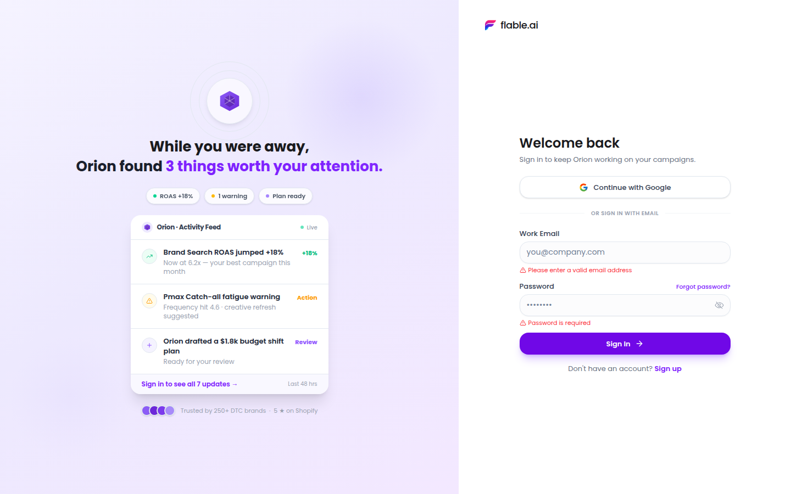

### 3.3 Bad email

Value `not-an-email` + any password. Error: **Please enter a valid email address**. Password error clears once filled.

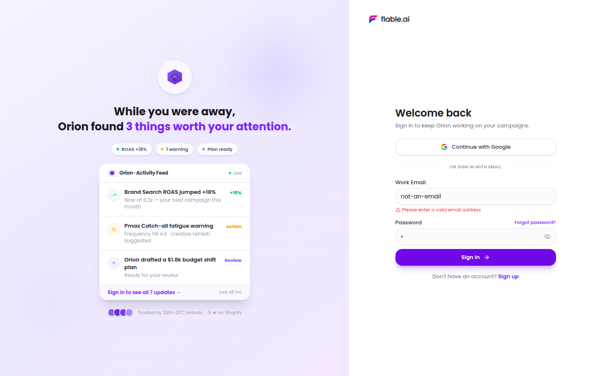

### 3.4 Wrong password

Email `admin@karmikh.com`, wrong password. Inline error above the button: **Invalid email or password**. URL does not change.

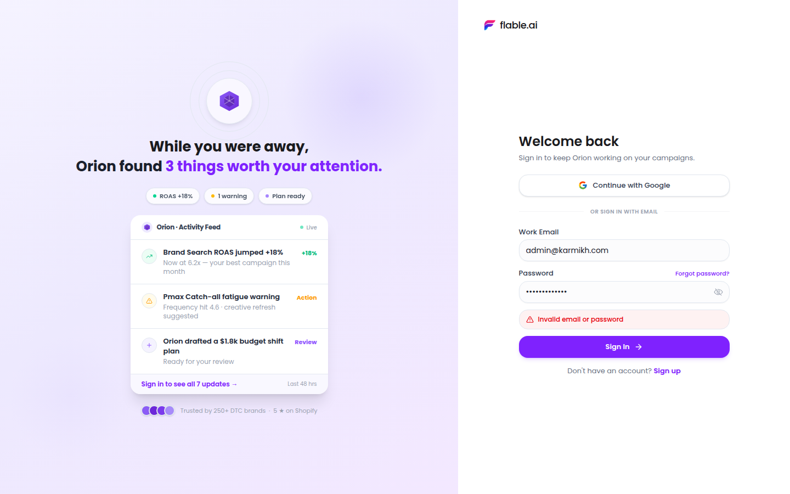

### 3.5 Password visibility

Eye toggle switches the password input from `type=password` to `type=text`. No extra copy.

### 3.6 Loading after valid Sign In

Button becomes a **circular spinner** + **Signing In…** (not a hairline track).

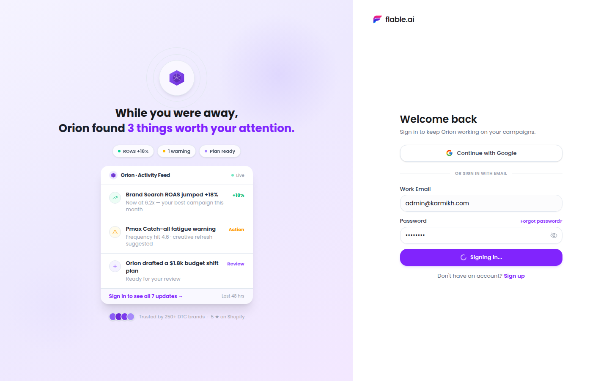

### 3.7 Success (Karmikh)

Toast: **Signed In!** (green check).  
URL: `/orion-agent`.  
No choose-profile, no OTP, no first-run connect for this account.

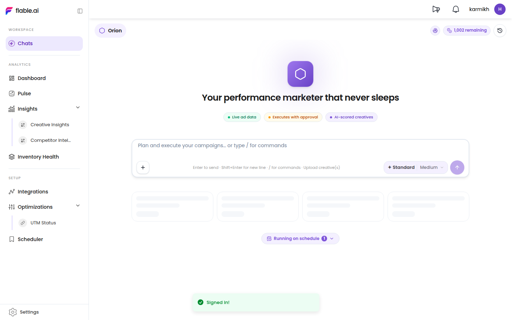

### 3.8 Google SSO

**Continue with Google** navigates **same tab** (no popup) to Google “Sign in with Google” / “Sign in to continue to **flable.ai**”. Email or phone, Next, Create account. Privacy Policy → `https://flable.ai/privacy-policy`, Terms → `https://flable.ai/terms`. OAuth was **not** completed.

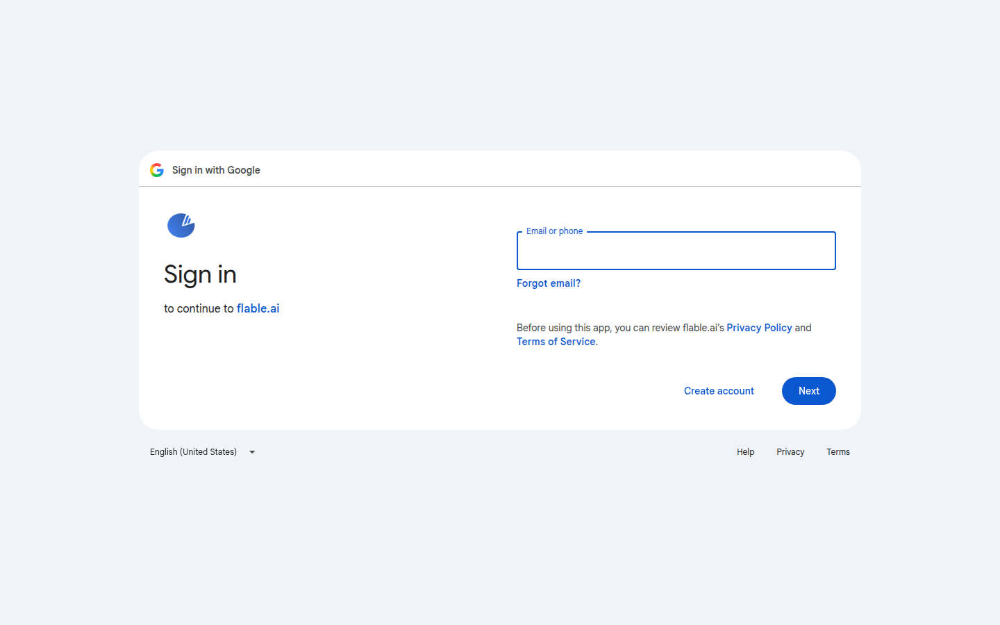

### 3.9 Forgot password / reset

Click **Forgot password?** → `/auth/reset-password`.  
**Layout:** centered white card on pale lavender (not split).  
H1: **Reset your password**  
Sub: “Enter your email and a new password below.”  
Fields: **Email** `you@company.com`; **New Password**; **Confirm Password** (both with eye toggles).  
Primary: **Reset Password →**  
Secondary: **← Back to Sign In** (returns to `/auth/sign-in`).

Empty submit errors:  
- **Please enter a valid email address**  
- **Must contain at least one number**  
- **Confirm your password**

Mismatch (valid-looking new vs confirm): **Passwords do not match**.  
A real reset was **not** submitted.

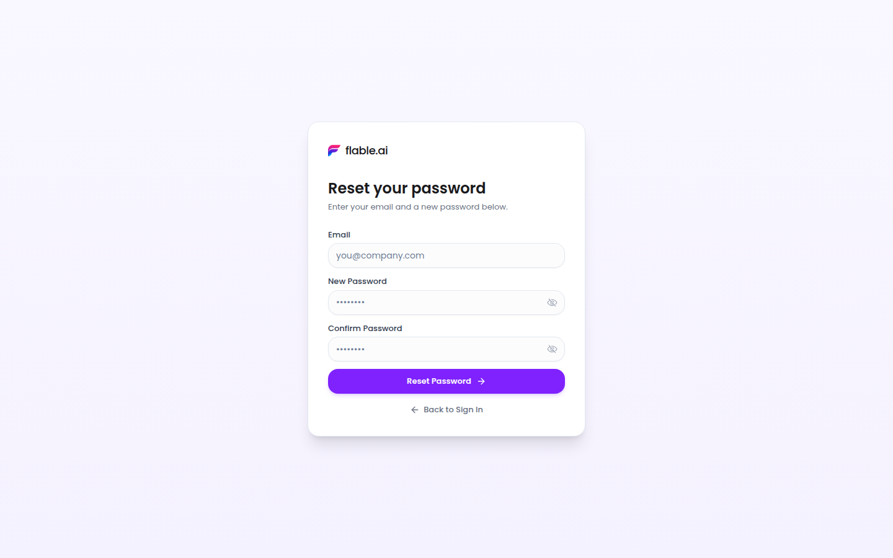
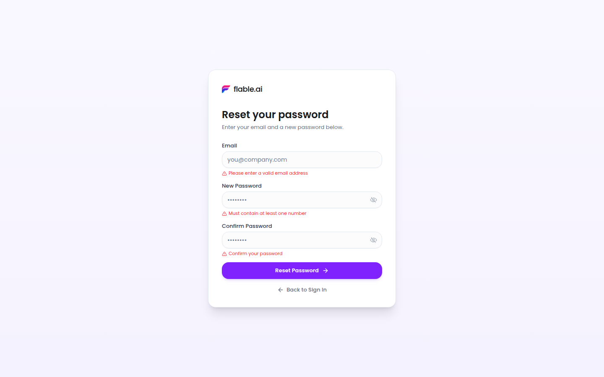
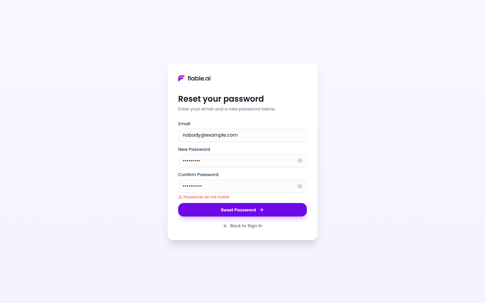

### 3.10 Mobile sign-in (390×844)

Left marketing pane is **dropped**. Form-only white column. Same fields and CTAs.

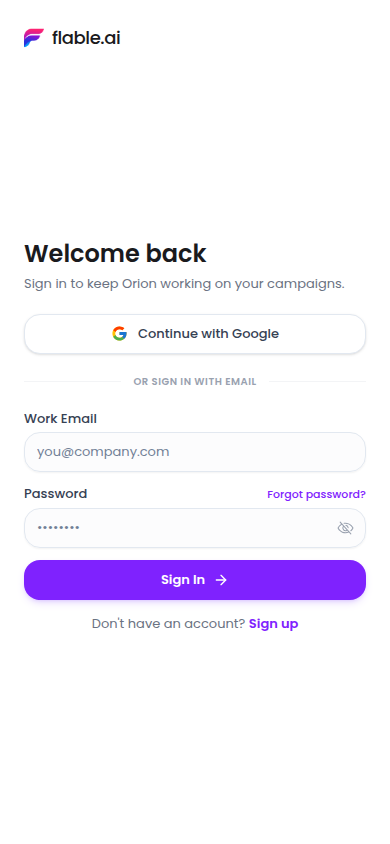

---

## 4. Signup, screen by screen

Signup is **open**. It is not invite-only. `/invitation` rendered blank.

### 4.1 Create your account (empty)

- **URL:** `/auth/sign-up` (also reached via **Sign up** on sign-in).
- **Layout:** split, same chrome as sign-in, different left rail.

**Left (verbatim)**  
“Your entire marketing stack. **One intelligent layer.**”  
“Meta, Google, Amazon and Shopify — unified, audited and optimized by Orion 24/7.”  
Pills: “2.1x ROAS” · “Audit ready” · “4 channels”  
Card: Orion / Audit ready / Last 30 days · all channels / BLENDED ROAS 2.1x +0.3 / AD SPEND $24,300 -12% / REVENUE $51k +8% / Meta Google Amazon Shopify  
Social: “Trusted by 250+ DTC brands · 5 ★ on Shopify”

**Right**  
H1: **Create your account**  
Sub: “Join thousands of D2C brands letting Orion run their campaigns.”  
SSO: **Sign up with Google** (same Google OAuth as sign-in, `redirect_uri=…/auth/sign-up`)  
Divider: **OR SIGN UP WITH EMAIL**  
| Field | id | Placeholder |
| --- | --- | --- |
| Full Name | `full_name` | Your full name |
| Work Email | `email_address` | you@company.com |
| Company URL | `company_url` | yourstore.com |
| Password | `password` | •••••••• + eye |

Password live checklist (appears once typing): **8+ chars** · **Uppercase** · **Lowercase** · **Number**. No special-character rule was shown.  
Primary: **Continue →**  
Footer: “Already have an account? **Sign in**”

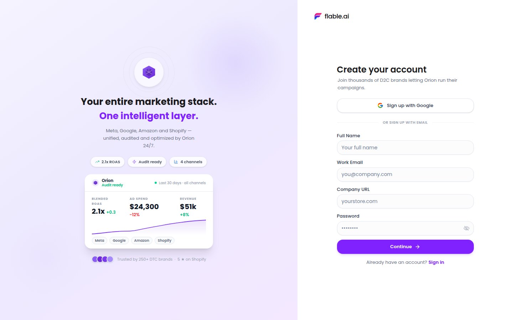

### 4.2 Empty Continue — validation

- Name must be at least 2 characters  
- Please enter a valid work email  
- Enter a valid domain (e.g. yourstore.com)  
- Must contain at least one number  

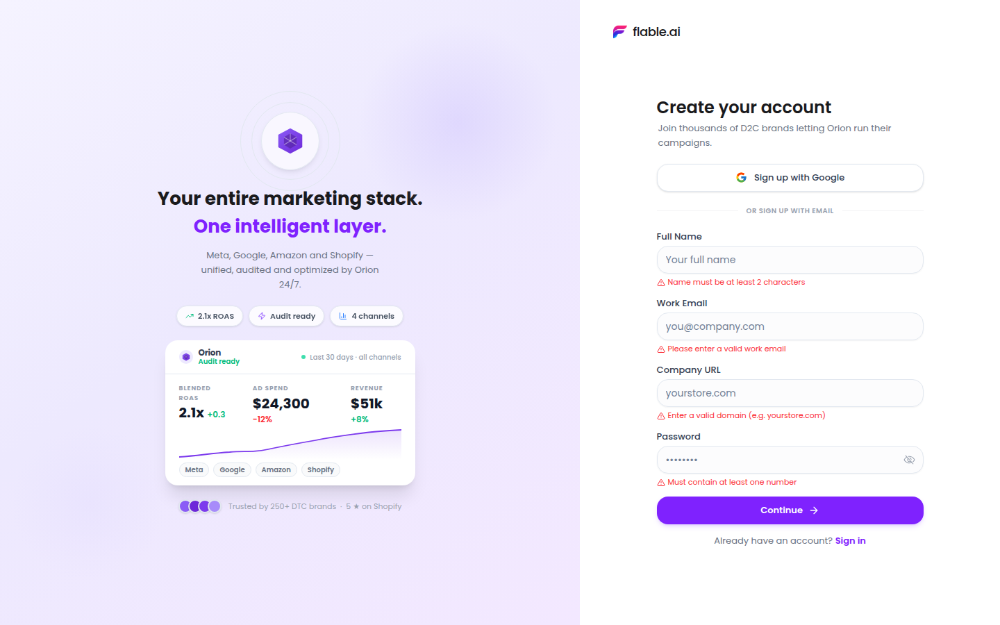

Password `a`: ✗ 8+ chars, ✗ Uppercase, ✓ Lowercase, ✗ Number  

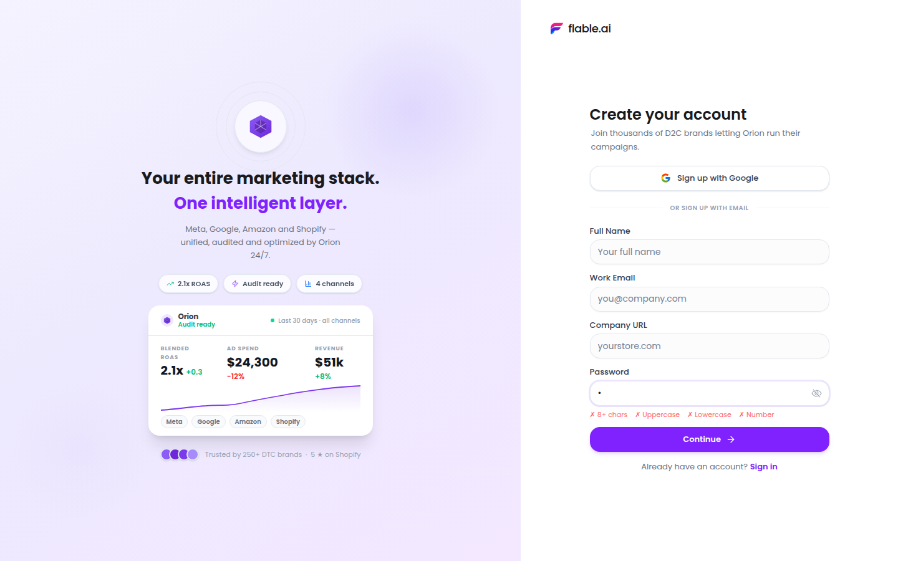

Password `Abcdefgh`: ✓ 8+ chars, ✓ Uppercase, ✓ Lowercase, ✗ Number  

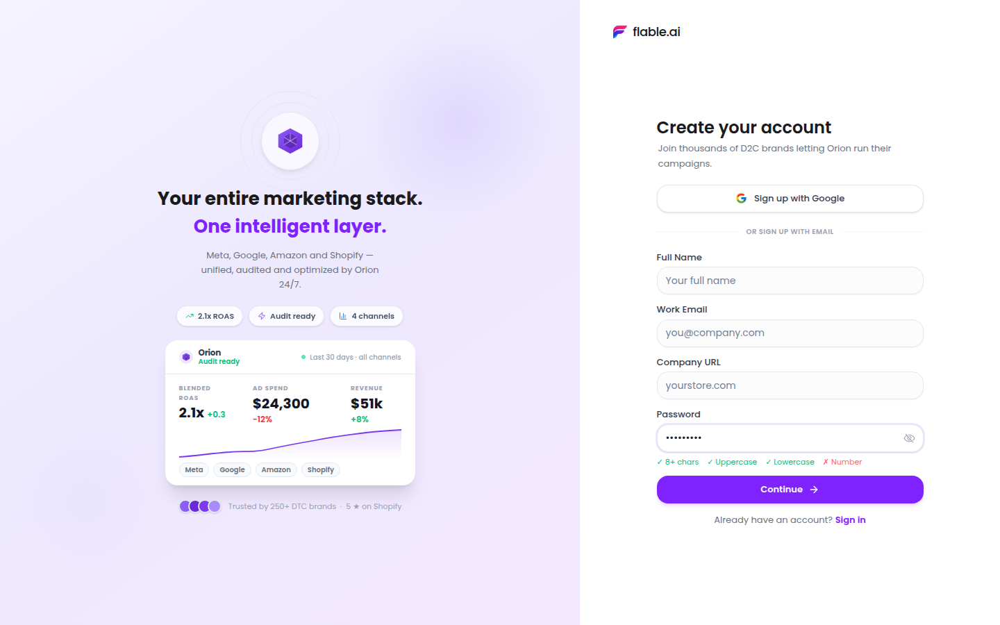

`Abcdefgh1` and `DocsTest9x` tick all four. Special characters are allowed but not required.

### 4.3 Company URL lookup

While typing a domain the field shows **Checking validity…** and the CTA can read **Looking up store…** (disabled).  
Success: green **Valid URL ✓** (observed for `allbirds.com`, `glossier.com`, `karmikh.com`).  
Gmail (`someone@gmail.com`) was accepted as Work Email; “valid work email” is format, not a block on consumer inboxes.

### 4.4 Creating account

CTA: circular spinner + **Creating account…**

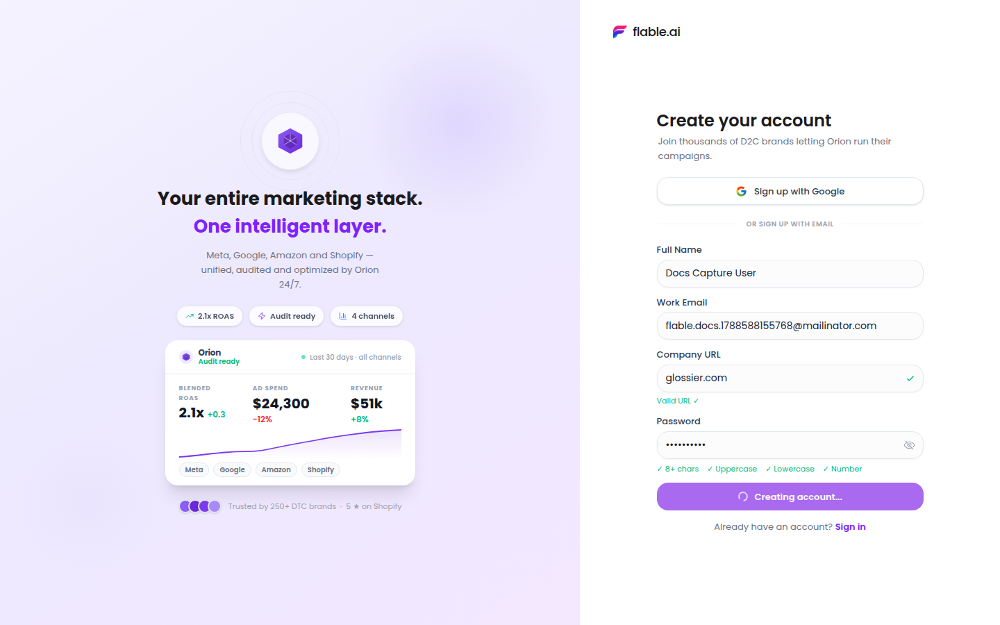

### 4.5 Duplicate of Karmikh

Email `admin@karmikh.com`, valid URL, valid password → red banner:  
**Email address is already in use : admin@karmikh.com**  
Stay on `/auth/sign-up`. Continue remains available.

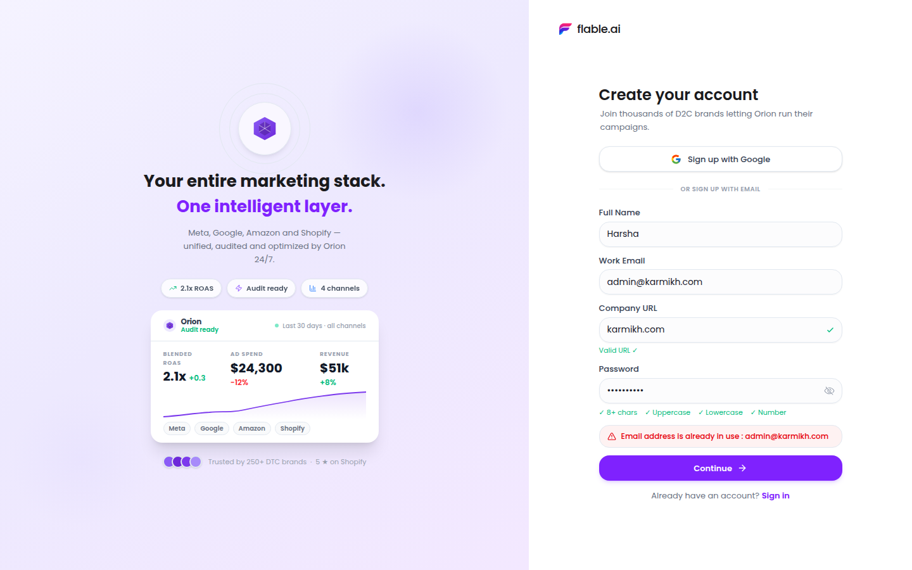

### 4.6 OTP — Check your inbox

After a successful create (disposable Mailinator user), URL: `/auth/email-verification`.

Left rail on this screen uses different social proof: **“Glossier, Olipop, Vuori · 4.9 ★ on G2”** (not the Shopify line).

Right: concentric rings around the Orion mark.  
H1: **Check your inbox**  
Sub: “We sent a 6-digit code to **{email}**”  
Six separate digit boxes.  
“Didn't get it? **Resend in 0:22**” (countdown). Then **Resend code**. Toast on resend: **OTP resent!**  
Email subject (from inbox, Flable’s own mail): **Your OTP for Verification**, from Flable `<info@flable.ai>`, body says valid **10 minutes**, Help Center / `support@flable.ai`.

Direct visit to `/auth/email-verification` without a pending signup still renders this UI with a **hardcoded demo email** `sarah@luminaryskincare.com` (not a live send).

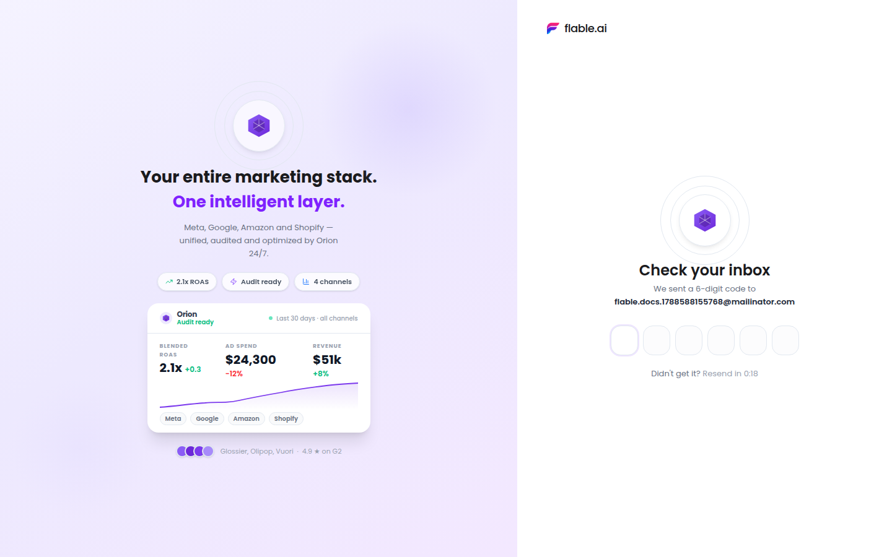

Wrong six digits: **Invalid OTP, Please verify again**

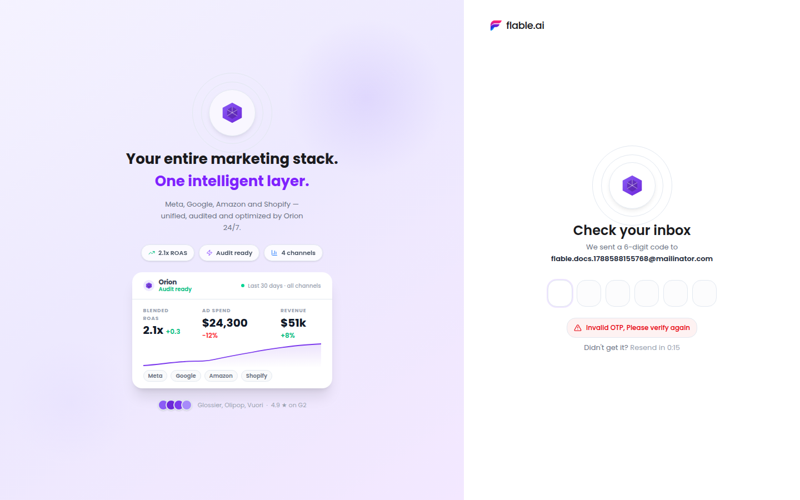

Unverified user who signs in again: toast **Email not verified — OTP sent to your inbox.** then the same OTP screen.

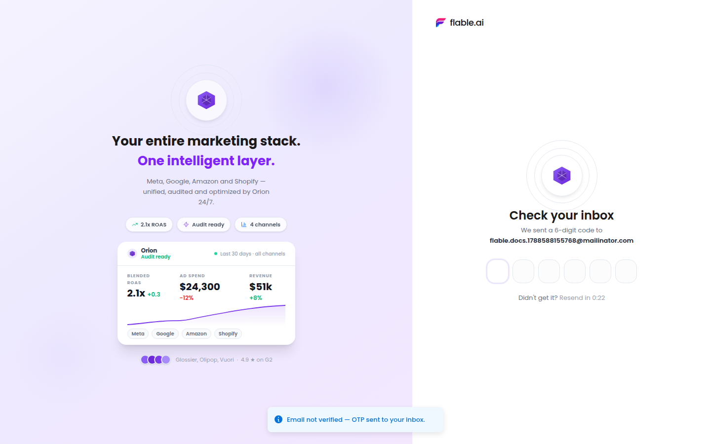

Correct code: digits turn green.  
H1: **You're in.**  
“Verified **{email}**. Redirecting…”  
Bottom: **Email confirmed**  
Then auto-redirect to connect-accounts.

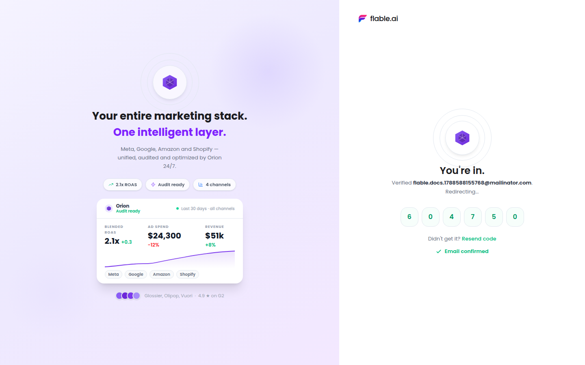

### 4.7 Connect your ad accounts (first-run, new user)

- **URL:** `/onboarding/connect-accounts`
- **Layout:** split. Left **dark purple**. Right white.
- **Step indicator:** **1 Connect Accounts** (active) · **2 Confirm Details** (inactive). No “step 1 of 4”. No Skip.
- Header right: avatar initial **D**, full email, **Sign out**.

**Left (verbatim)**  
H1: **Wake Orion up.**  
“Connect a channel and Orion starts working in the background. The more it sees, the more profit it can find.”  
“Connect your first channel to begin.” · **0 of 5**  
Locked rows:  
- Exact winning & losing ads — Connect Meta to unlock  
- Search & Shopping waste map — Connect Google to unlock  
- Your true profit baseline — Connect Shopify to unlock  
- Organic vs paid gaps — Connect Search Console to unlock  
“50+ TOP D2C BRANDS TRUST ORION”  
Quote attributed to **Powerlook · Growth team · D2C fashion**.

**Right**  
H1: **Connect your ad accounts**  
“We'll pull 30 days of campaign data through read-only OAuth. Connect at least one to generate your free audit.”

Required rows, each **Connect**:  
- **Meta Ads** — Facebook & Instagram  
- **Google Ads** — Search, Shopping & YouTube  
- **Shopify** — Orders, revenue & store analytics  

**OPTIONAL INTEGRATIONS**  
- **Google Search Console** Optional — Organic search impressions & clicks  
- **Google Analytics** Optional — Sessions, conversions & traffic sources  

Footer: “Connect at least one account to continue.”  
**Continue →** disabled / faded until a connection exists.

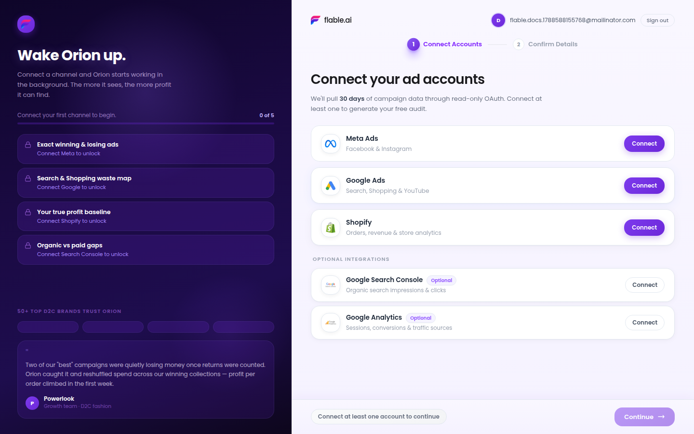

**Meta Connect** (first Connect button) same-tabs to Facebook login (OAuth). Not completed. No Flable UI after that besides the Facebook page.

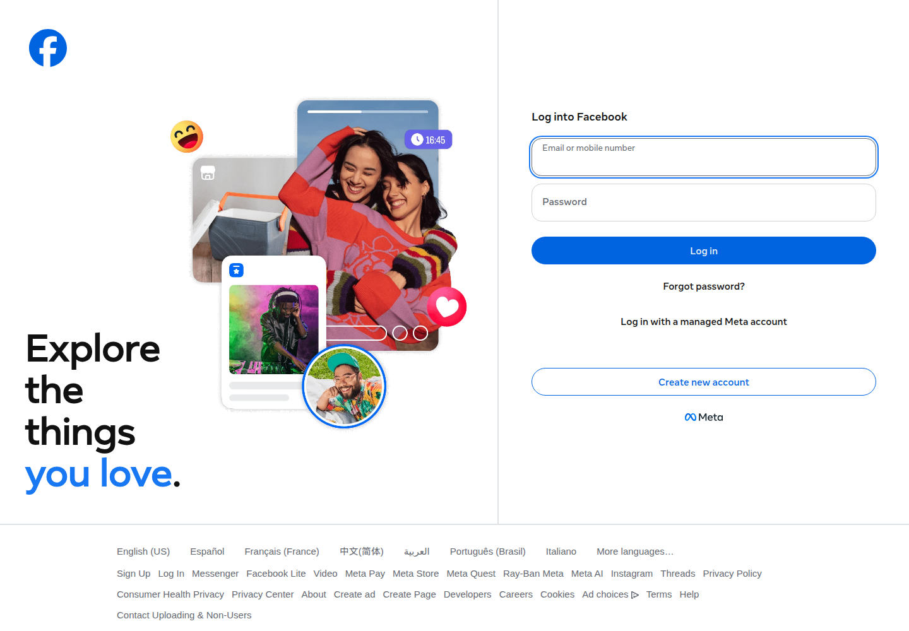

**Confirm Details / pricing:** navigating those URLs while 0 accounts are connected **does not show those screens**; the app stays on connect-accounts. Those steps therefore exist in the stepper/routes but were not reachable without completing OAuth (no test ad accounts used).

**Sign out** on this screen → `/auth/sign-in` + toast **Logged out**.

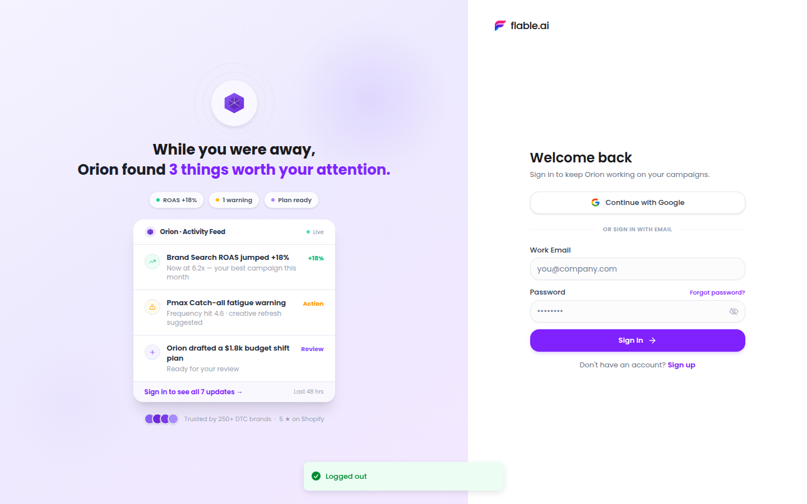

### 4.8 Mobile signup

Marketing pane dropped. Same four fields + Google + Continue.

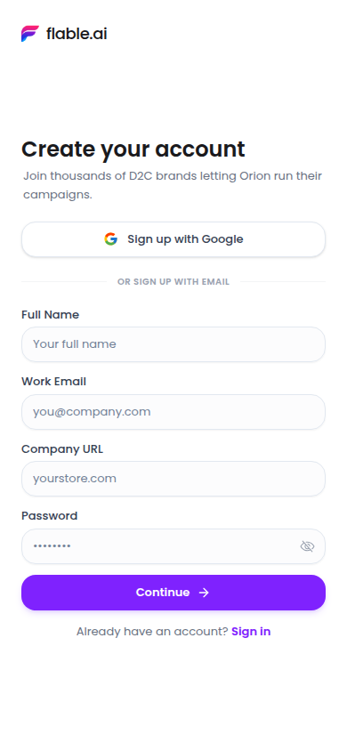

---

## 5. Post-login first-run / residual setup (Karmikh)

This account is already onboarded to Orion. There is no first-run connect wizard. Residual setup is the **Setup Guide**.

### 5.1 Orion home

- **URL:** `/orion-agent` (also what `/` becomes).
- **Layout:** left app sidebar + Orion empty chat.

Sidebar: **WORKSPACE** Chats · **ANALYTICS** Dashboard, Pulse, Insights (Creative Insights, Competitor Intelligence), Inventory Health · **SETUP** Integrations, Optimizations (UTM Status), Scheduler · Settings.  
Header: megaphone, bell, workspace label **karmikh**, avatar **H**.  
H1: **Your performance marketer that never sleeps**  
Pills: Live ad data · Executes with approval · AI-scored creatives  
Composer placeholder: “Plan and execute your campaigns… or type / for commands”  
Credits pill: **1,002 remaining** · model **✦ Standard / High** · **Running on schedule 1**

Top of main column (after settle): **Setup 0 of 3 done** · **1,000 credits to earn**  
Bottom-right card: **Setup Guide 0 / 3 done**

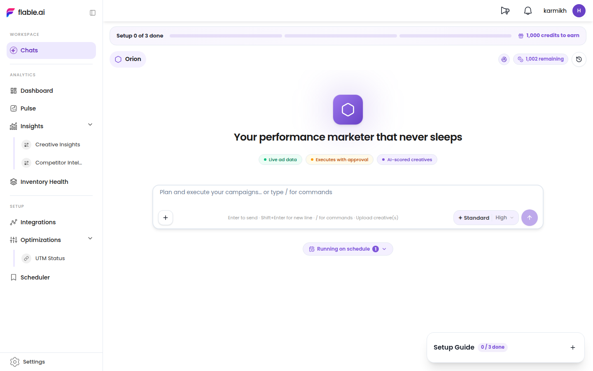

Clicking the bar/card expands the guide (same page, overlay card — not a new URL).

### 5.2 Setup Guide (0 / 3)

**Earn 1,000 credits**

1. **Connect core channels**  
   “Google Ads and Meta Ads connected”  
   “Shopify still pending. Orion reads spend, orders and RTO signals from these.”  
   CTA **Connect** · **+500 credits**
2. **Repair Ad Tracking**  
   “Connect Shopify to enable this step” (no CTA; locked)
3. **Tune Orion to your brand**  
   “Set Up your Objectives, Targets and Reporting time.”  
   CTA **Answer questions** · **+400 credits**

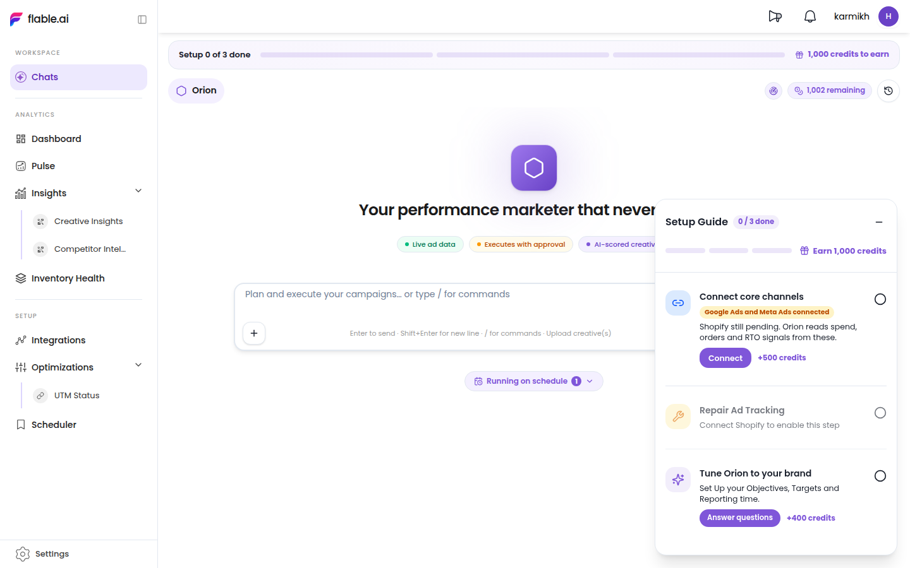

**Connect** on step 1 → `/integrations` (full catalog, not the first-run OAuth wizard).

**Answer questions** → modal overlay on `/orion-agent`. **QUESTION n OF 7** + 7-segment bar. Close (X) / back. Did **not** click **Generate my templates** (would write templates onto this workspace).

### 5.3 Setup Guide questions (verbatim)

**Q1 — Who is Orion working for?**  
“Everything after this (questions, defaults, schedules, templates) adapts to your role.”  
Founder / CXO — I own the P&L  
Media buyer — I run the campaigns  
Growth head — I own the plan  
Creative lead — I make the ads  
**Agency AM — I manage client brands**  
+ Something else  

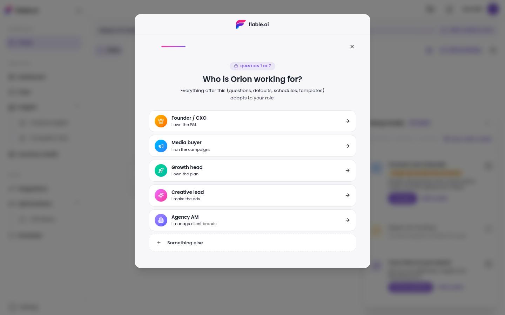

**Q2 — What should Orion help your brand achieve?**  
“Tap in priority order. 1 is your top objective. Tap again to remove.”  
Bring more sales · Generate leads · Bring traffic · Drive awareness · Add your own · Continue (disabled until at least one tap)

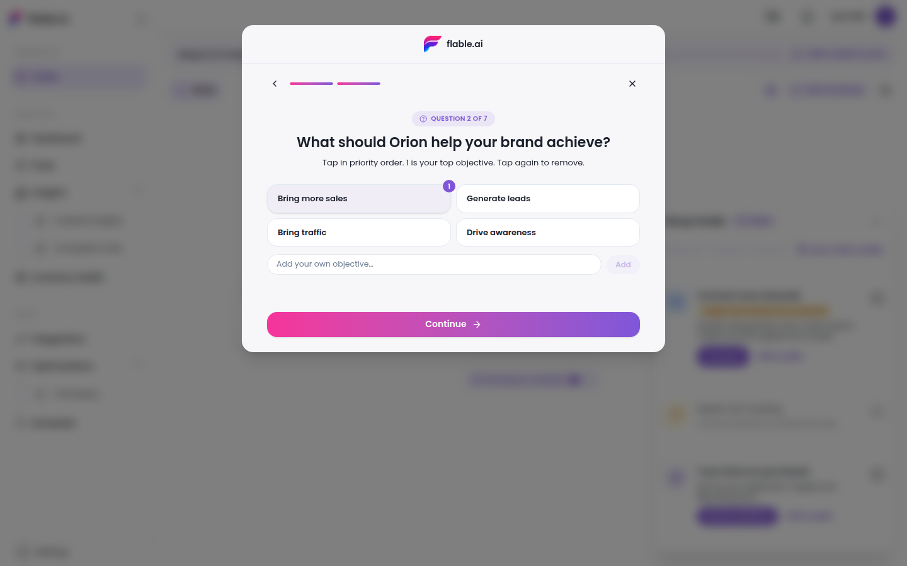

**Q3 — Pick up to 6 KPIs to track**  
“Shown based on your objectives. Selection order = report order.”  
SALES · PRIORITY 1: ROAS, Revenue, Purchases, AOV, CAC, CPC · Add your own sales KPI  

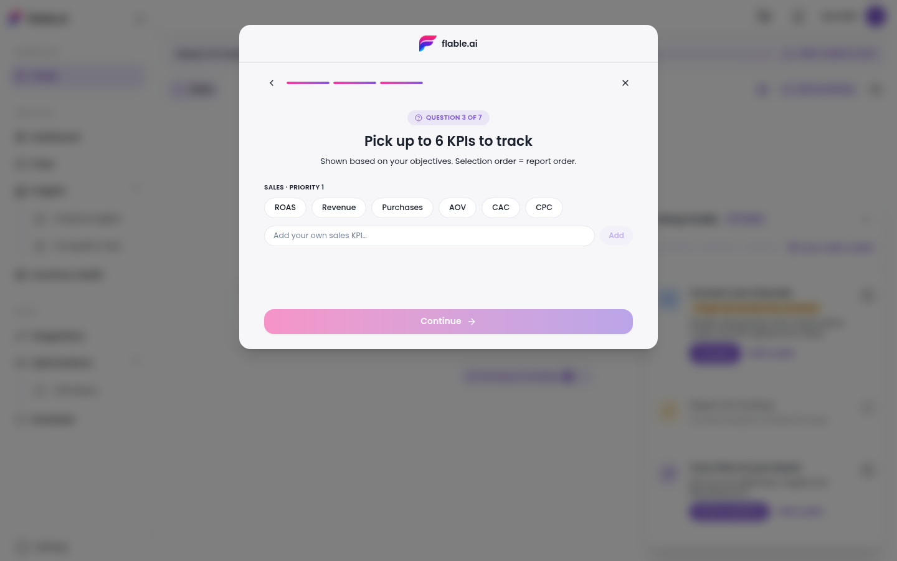

**Q4 — What hurts the most right now?**  
“Orion attacks these first. Select as many as apply, or add your own.”  
I don't catch wasted spend until it's too late / The leak shows up at month end, not day one / Ad platform numbers don't match my bank account / Reported ROAS vs what actually lands / I can't tell if my agency is doing a good job / No independent read on performance  

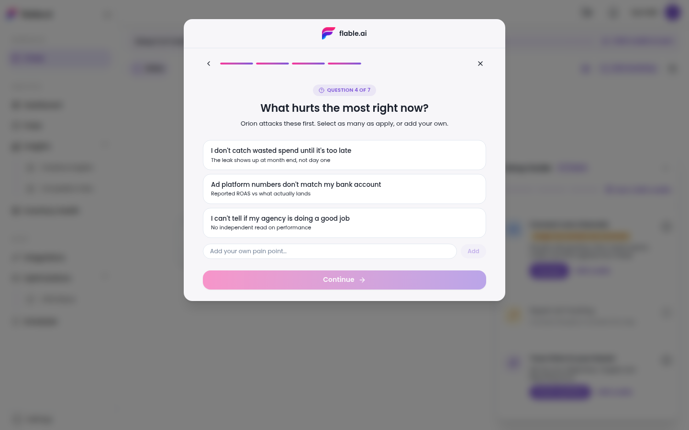

**Q5 — How should Orion detect anomalies?**  
“Per level, pick the comparison windows Orion watches. Defaults are tuned to how fast each level moves.”  
CREATIVES / CAMPAIGNS / OVERALL ACCOUNT, each with Yesterday vs prev day · 3d vs prev 3d · 7d vs prev 7d · MTD vs prev month pacing  

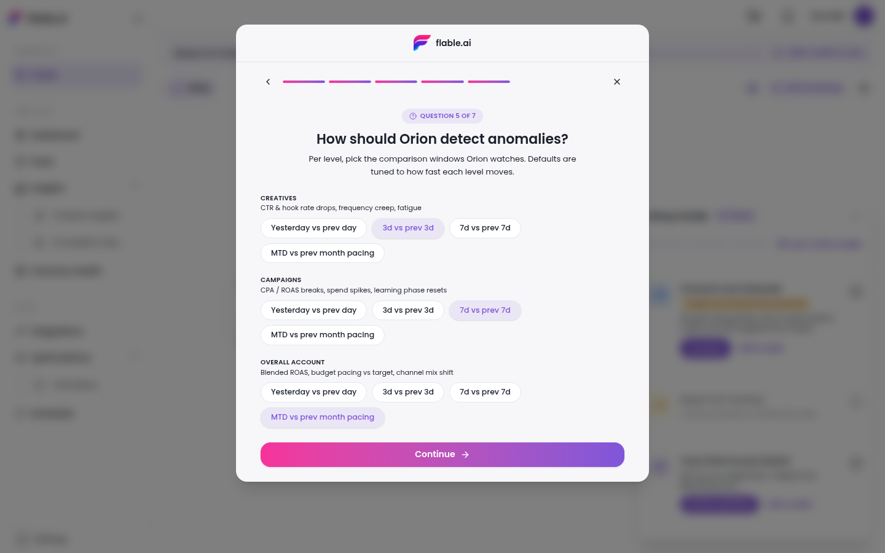

**Q6 — How often should Orion reach you?**  
“Pick a cadence, or let Orion set it per schedule from your role, spend and live signals.”  
CADENCE: Let Orion decide · Daily · Weekly · Both · Only when something needs attention  
PREFERRED TIME (08:00 AM in this session) · CHANNEL: Email; **WhatsApp (Coming soon)**  
Box: “Guardrails are built in, nothing to configure” / “POAS floor, daily spend caps, approval on every execution, and full reversibility are always on. Orion never moves money without a logged, undoable change record.”

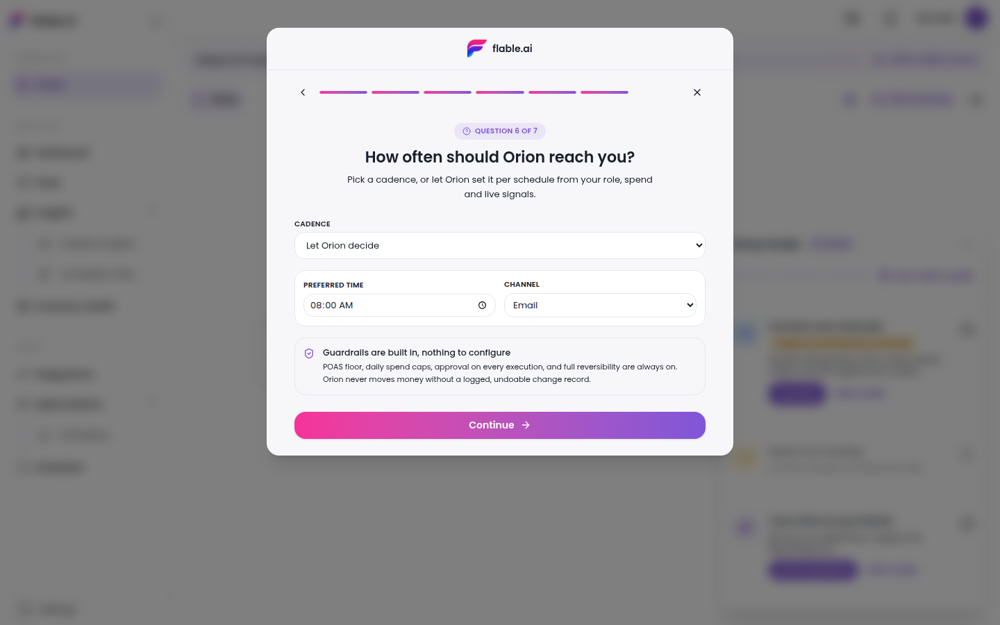

**Q7 — How should Orion talk to you?**  
“This shapes how briefings and alerts are written.”  
Blunt & direct / Detailed & data heavy / Encouraging & coaching / + Something else  

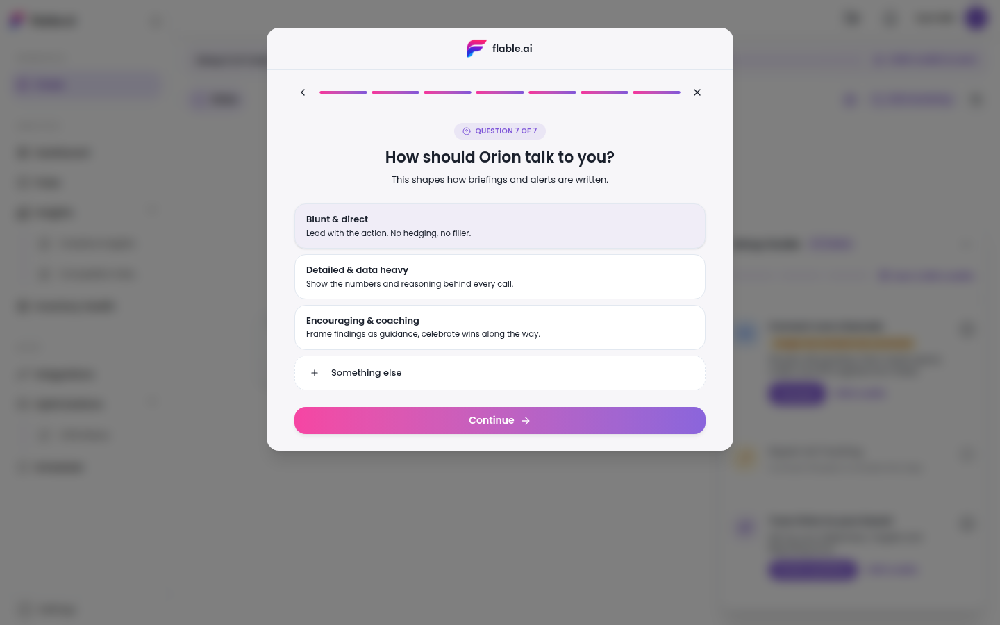

**FINAL REVIEW**  
H1: **Here's what Orion will set up for you**  
“Confirm and Orion generates your templates, or edit any answer first.”  
Rows (Role, Brand objectives, KPIs to track, Your pain, Anomaly detection, Cadence, Tone) each with an edit pencil.  
CTA: **Generate my templates →**

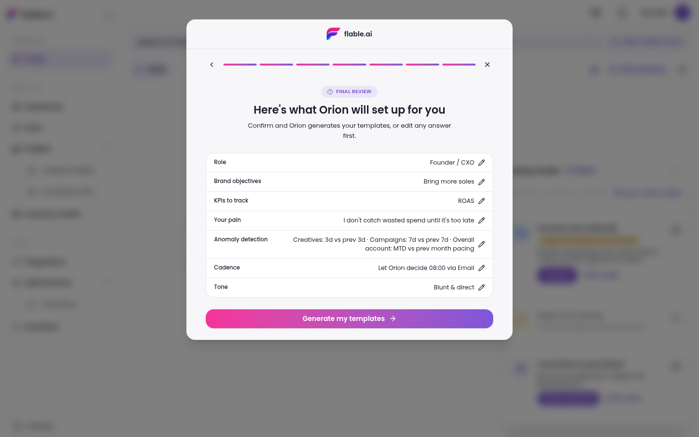

### 5.4 Settings (residual, not a wizard)

`/settings/` — three-column: app sidebar, settings nav, form.

Nav: General Settings · Personalization · Competitors (Competitor Social Handles) · Reports (Email Reports) · Cost Setting · Attribution Settings  

General: Choose Language (English (en-us); German coming soon) · Time Zone (Asia/Calcutta) · Industry (empty) · Annual Revenue (empty) · Currency (empty). Industry list is a long catalog (Fashion, Electronics, Skincare, CRM Software, etc.).

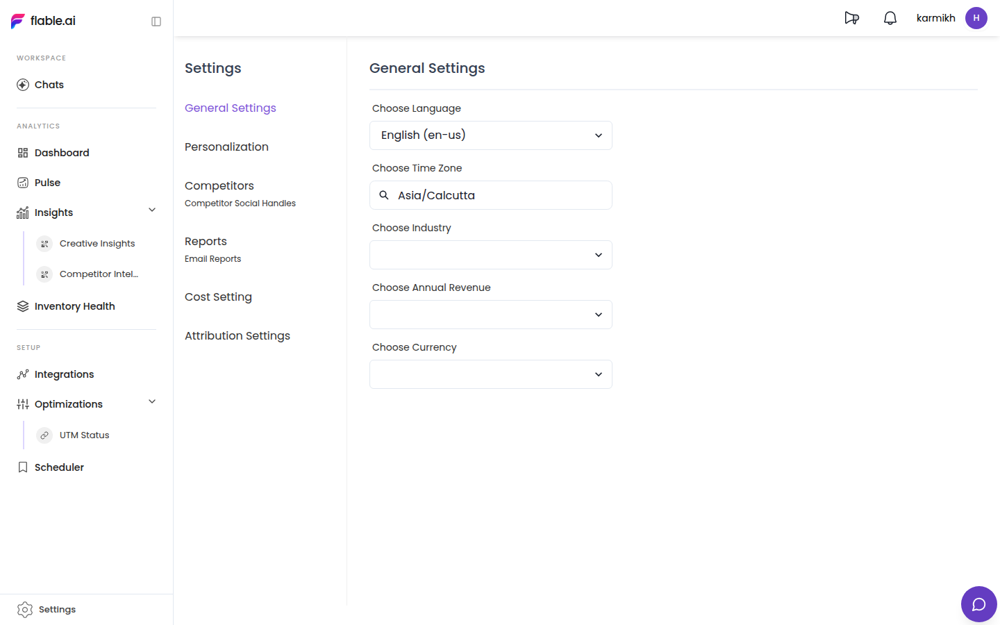

Personalization: **Your AI CMO Personalization** / “Overview of KPIs, Weights, and Target Setup for all your channels.” / **Edit Personalization**  
AI CMO Persona: **Be direct and strategic**  
Table includes Store and Facebookads rows marked Complete.

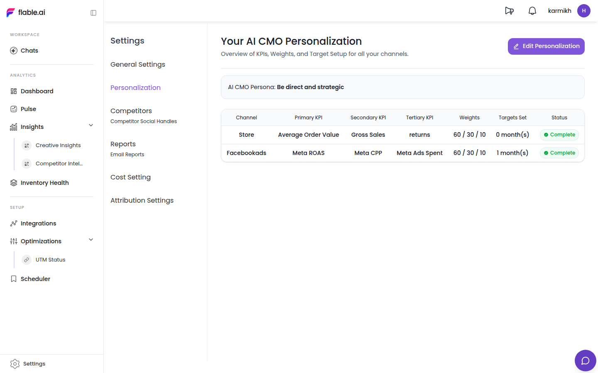

Competitors: Instagram handle add; existing handles on this account included nonasties, urban_monekey, Knitroot.  
Reports: Create new report; an “Agent Weekly Report” already scheduled to `admin@karmikh.com`.  
Cost Settings: COGS Loading… · Shipping Added · Payment Gateway Not Added · Custom Expenses Added.  
Attribution Settings: Meta Ads and Google Ads **Get Started** cards plus copy for an Attribution Agent.

### 5.5 Users / invite (immediately after, via URL)

`/user/manage-users`  
H1: **Users**  
“Add, edit and delete users and assign roles to them”  
**Add User** · Search users… · Active Users (5) · Inactive Users (0)  
Roles seen: Admin, Contributor, **Super Admin** (Harsha / `admin@karmikh.com`). Status Accepted. Invited By column. Super Admin row has a lock instead of remove.

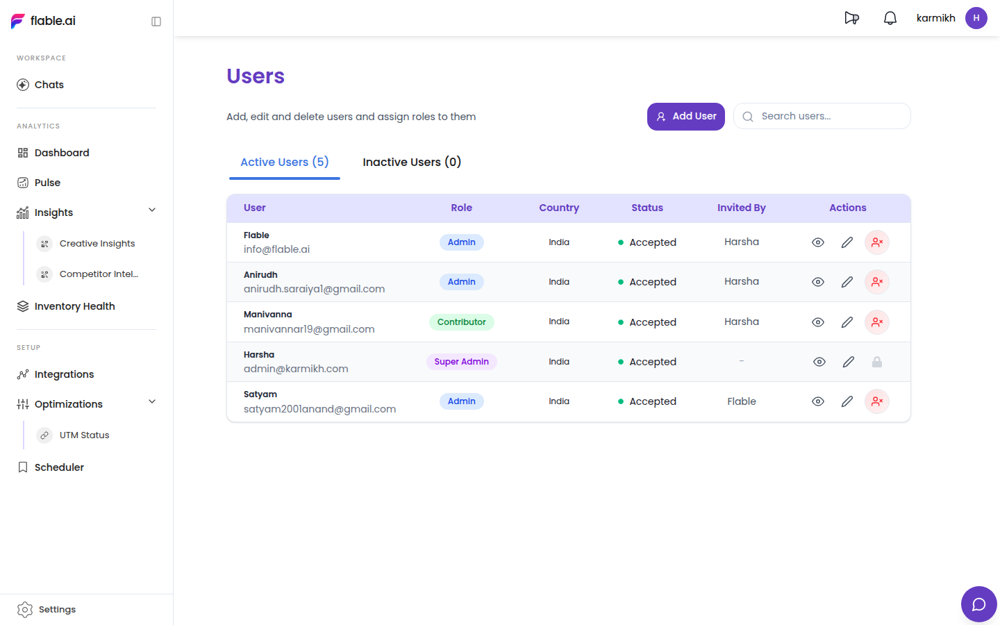

**Add User** modal overlay: purple header **Add New User**, a **2-step** progress bar (step 1 highlighted), blue info: “Enter the email address of the user you want to invite. We'll check if they already have a Flable account.”  
Field: Email Address * placeholder `user@example.com`  
Cancel · **Verify Email** (looks disabled until a valid email).

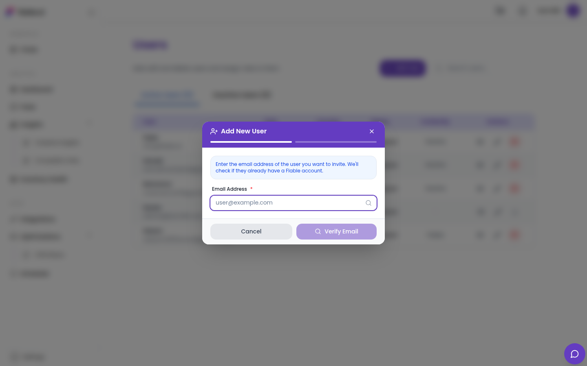

No seat-count or plan-limit copy on this screen.

### 5.6 Integrations catalog

`/integrations`  
Sections and buttons as of this capture:

| Section | Items | State on Karmikh |
| --- | --- | --- |
| CRM, Channels & Marketplace | Shopify, Amazon Selling Partner, Myntra, Hubspot, Zoho CRM, Casa | all **Add** |
| Affiliate Marketing | GoAffPro | **Disconnect** |
| Shipping and Logistics | Unicommerce, iThink Logistics, Shiprocket, Vinculum | **Add** |
| Ads Account | Google Ads, Meta Ads, Amazon Ads | **Manage** + **Disconnect** (Amazon: “1 profile connected”) |
| Analytics & SEO | Google Search Console, Google Analytics | **Manage** + **Disconnect**; Google Drive / Sheets **Add** |
| Socials | WhatsApp, Instagram, Slack | **Add** |

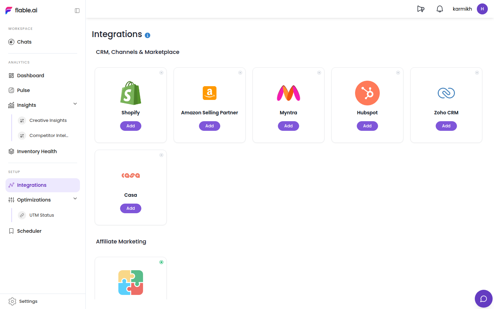

**Shopify Add** → `/integrations/shopify`  
Subcopy on the form card: “Connect your Shopify account to manage your logistics seamlessly” · badge **Integration Setup**  
Seller Panel credentials: Store Name + `.myshopify.com` suffix, API Key, API Secret, Admin Access Token. CTA **Connect to Shopify** (disabled empty). Left: 9-step “Setup Instructions” with `read_*` permission list. **← Back to Integrations**.

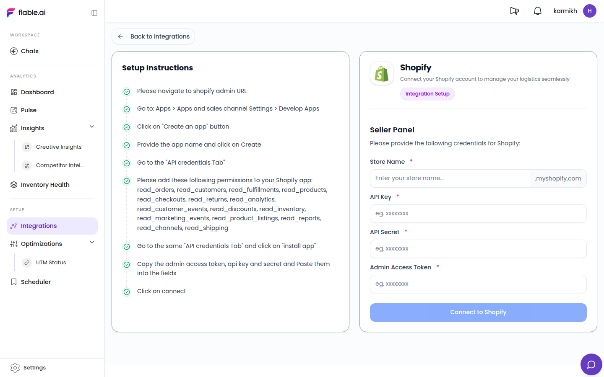

**Facebook Ads** from this catalog is **not** the onboarding OAuth card. It is “Integration steps”: paste **Access Token** and **Account IDs** (Comma separated..) · **Connect**. Left copy asks for Meta app permissions `ads_management, ads_read, business_management, read_insights`.

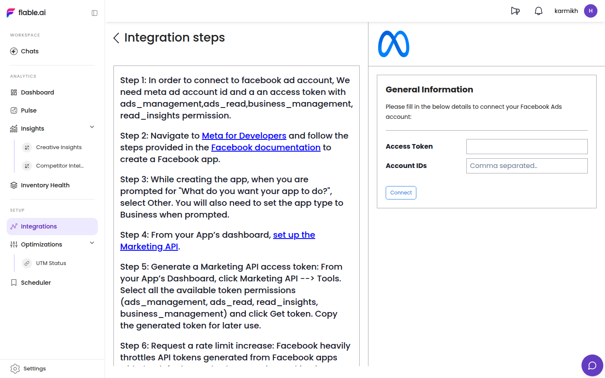

Google Ads **Manage** opens modal **Manage Google Ads** / “Connect ad accounts.” Search by name, ID, currency. Example row: **Karmikh** `ID: 7443193870 · INR · Asia/Calcutta`. Footer: “1 account selected” · Cancel · **Connect Accounts**.

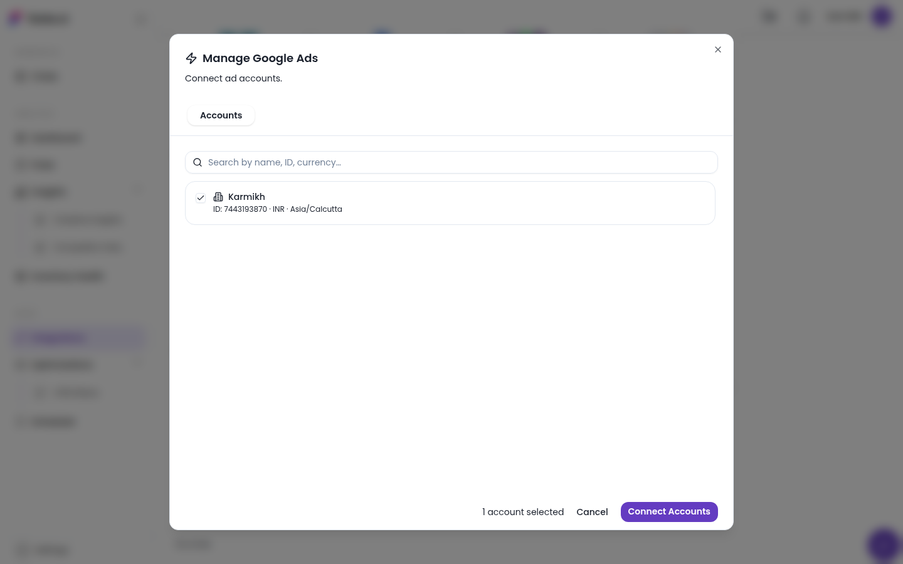

### 5.7 Dashboard (stable analytics home)

`/dashboard` · Last 7 days. Overall Performance empty: “No overall performance data available for the selected date range.” Alerts empty. Meta Ads widgets show numbers (e.g. ROAS 2.04). Floating purple chat FAB on several non-Orion pages.

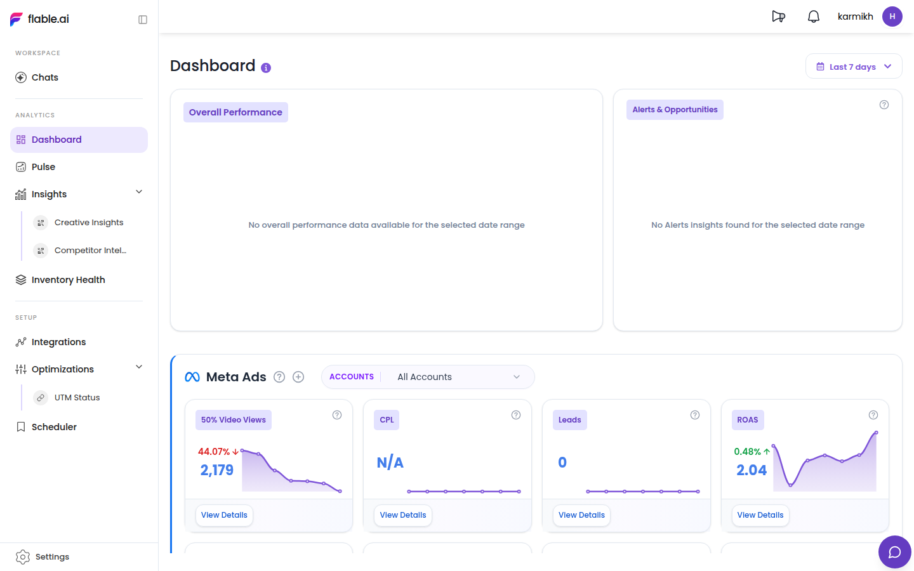

Workspace switcher: the **karmikh** label did not open a client list in this session. Avatar **H** also did not expose a reliable Log out menu from Orion (Sign out **does** exist on the first-run connect header).

---

## 6. Decision points and skips

| Place | Skip? | Continue / primary | Back |
| --- | --- | --- | --- |
| Sign-in | n/a | Sign In (enabled even when empty; validates on click) | n/a |
| Reset password | n/a | Reset Password | Back to Sign In |
| Signup | n/a | Continue disabled while **Looking up store…**; then Creating account… | Sign in |
| OTP | Resend after countdown (not Skip) | Auto-submit on 6th digit | none |
| Connect accounts | **None** | Continue **locked** until ≥1 Connect | Sign out only |
| Confirm Details / pricing | Not reached | — | Redirected to connect-accounts |
| Setup Guide | User can ignore the card | Connect → Integrations; Answer questions → 7-step modal | X closes modal |
| Q2–Q7 Continue | Disabled until a selection (Q2, Q3, Q4) | Continue → | `<` back in modal |
| Final review | X / Escape closes without generating | Generate my templates | Back + per-row edit |
| Add User | Cancel | Verify Email | X |

Google/Meta OAuth: leaving the IdP without completing returns you to Flable only if you use browser back; Connect itself is a full navigation.

---

## 7. Copy deck (verbatim strings)

**Sign-in**  
Welcome back  
Sign in to keep Orion working on your campaigns.  
Continue with Google  
OR SIGN IN WITH EMAIL  
Work Email  
Forgot password?  
Sign In  
Don't have an account? Sign up  
Please enter a valid email address  
Password is required  
Invalid email or password  
Signing In…  
Signed In!  
Logged out  
While you were away, Orion found 3 things worth your attention.  
Sign in to see all 7 updates →  
Trusted by 250+ DTC brands · 5 ★ on Shopify  

**Reset**  
Reset your password  
Enter your email and a new password below.  
New Password / Confirm Password  
Reset Password  
Back to Sign In  
Must contain at least one number  
Confirm your password  
Passwords do not match  

**Signup**  
Create your account  
Join thousands of D2C brands letting Orion run their campaigns.  
Sign up with Google  
OR SIGN UP WITH EMAIL  
Full Name / Company URL  
Continue  
Already have an account? Sign in  
Name must be at least 2 characters  
Please enter a valid work email  
Enter a valid domain (e.g. yourstore.com)  
8+ chars / Uppercase / Lowercase / Number  
Checking validity… / Looking up store… / Valid URL ✓  
Creating account…  
Email address is already in use : admin@karmikh.com  
Your entire marketing stack. One intelligent layer.  
Meta, Google, Amazon and Shopify — unified, audited and optimized by Orion 24/7.  

**OTP**  
Check your inbox  
We sent a 6-digit code to {email}  
Didn't get it? Resend in {mm:ss} / Resend code  
OTP resent!  
Invalid OTP, Please verify again  
Email not verified — OTP sent to your inbox.  
You're in.  
Verified {email}. Redirecting…  
Email confirmed  
Glossier, Olipop, Vuori · 4.9 ★ on G2  

**Connect accounts**  
Wake Orion up.  
Connect a channel and Orion starts working in the background. The more it sees, the more profit it can find.  
Connect your first channel to begin.  
0 of 5  
Connect your ad accounts  
We'll pull 30 days of campaign data through read-only OAuth. Connect at least one to generate your free audit.  
OPTIONAL INTEGRATIONS  
Connect at least one account to continue.  
Sign out  

**Orion / Setup Guide**  
Your performance marketer that never sleeps  
Setup 0 of 3 done  
1,000 credits to earn  
Setup Guide 0 / 3 done  
Earn 1,000 credits  
Connect core channels  
Google Ads and Meta Ads connected  
Shopify still pending. Orion reads spend, orders and RTO signals from these.  
Repair Ad Tracking  
Connect Shopify to enable this step  
Tune Orion to your brand  
Set Up your Objectives, Targets and Reporting time.  
Answer questions  
(plus Q1–Q7 and FINAL REVIEW strings in §5.3)

**Users**  
Add, edit and delete users and assign roles to them  
Add User / Add New User  
Enter the email address of the user you want to invite. We'll check if they already have a Flable account.  
Verify Email  

**Shopify form**  
Connect your Shopify account to manage your logistics seamlessly  
Integration Setup  
Connect to Shopify  

---

## 8. Gaps vs a modern D2C analytics onboarding (facts only)

These are observations of **this** live path, not proposed screens.

- Entry is login, not a product page. Root URL always becomes `/auth/sign-in`.
- Signup asks for **Company URL** and blocks Continue on a live lookup. There is no “I’ll add the store later” on that form.
- Email OTP is mandatory. Unverified users cannot skip to the app.
- First-run connect has **no Skip**, no “do this later,” and **Continue is disabled** at 0 of 5. Optional GSC/GA do not unlock Continue by themselves in the footer copy (“at least one account”).
- The visible stepper is **two steps** (Connect Accounts → Confirm Details). `/onboarding/pricing` exists as a route but this new user never saw a plan picker, referral field, or “setting up” screen because Confirm Details never opened.
- Karmikh, already on Orion, still shows **Setup 0 of 3** because Shopify is pending; Google/Meta connected does not tick step 1. Repair tracking is explicitly gated on Shopify.
- Two different Meta connect UIs exist: OAuth from first-run vs **paste token** from Integrations.
- Shopify first-run card promises OAuth-style connect; the Integrations Shopify page is **custom app API credentials** and logistics-flavored subcopy.
- “Work Email” accepts Gmail. Duplicate email echoes the address in the error.
- Password reset sets a new password in the browser rather than sending a reset link (no “check your email” state captured).
- Loaders on auth CTAs are **circular spinners** on a solid purple button, not a hairline bar.
- Agency / multi-client: **Agency AM** is a Setup Guide role; Users supports multiple seats. No client-picker appeared for Karmikh. `choose-profile` never rendered.
- `/invitation` is an empty document.
- Mobile auth drops the left marketing pane entirely (form only).
- Direct `/auth/email-verification` without session shows a **demo** inbox address (`sarah@luminaryskincare.com`).

---

## 9. Open questions for Abbas

Only where the live product was ambiguous or blocked:

1. **Confirm Details** — What does that step actually contain (brand confirm, category, referral)? The stepper names it; the route redirected until a channel was connected. OAuth was not completed, so the screen was never painted.
2. **Pricing / Razorpay** — Checkout.js is on the HTML shell. `/onboarding/pricing` redirected. Is plan selection still in this devolve first-run after Confirm Details, or only later in billing?
3. **0 of 5 vs three required Connect rows + two optional** — Left rail says 0 of 5 (Meta, Google, Shopify, GSC, GA). Does connecting one optional property enable Continue, contrary to the footer?
4. **Setup 0 of 3** while ads are connected — Is step 1 literally “all of Google + Meta + Shopify,” so ads-only tenants stay at 0 forever?
5. **Two Meta connect implementations** (OAuth vs token paste) — Which is intended for new D2C vs agency?
6. **Shopify copy** says “logistics seamlessly” on a store-credentials form. Is that leftover, or is Shopify positioned as 3PL here?
7. **Workspace switcher** — Header shows `karmikh` but clicking it did not open another client. Is multi-store switching elsewhere?
8. **Log out from Orion** — Sign out is obvious on first-run connect; from Orion the avatar menu did not show Log out in this capture. Where is the supported path?
9. **Hardcoded OTP preview email** on a cold `/auth/email-verification` visit — expected demo, or a leak of a sample tenant?
10. **Disposable user** created on devolve (`flable.docs.{timestamp}@mailinator.com`, clientId `A01210`) remains stuck on connect-accounts. Confirm whether that tenant should be deleted.

---

## Capture notes

- Method: headed-equivalent Chromium against production-like devolve. No prototype files were edited.
- Screenshots in this folder are the curated set (`01-…`–`47-…`). Working dumps live in `raw/` (gitignored).
- Auth secrets, JWTs, and the provided password are not stored in this markdown.
- Browser tools were not available; the walk used Playwright + system Chrome. Visual QA matches the PNGs above.
